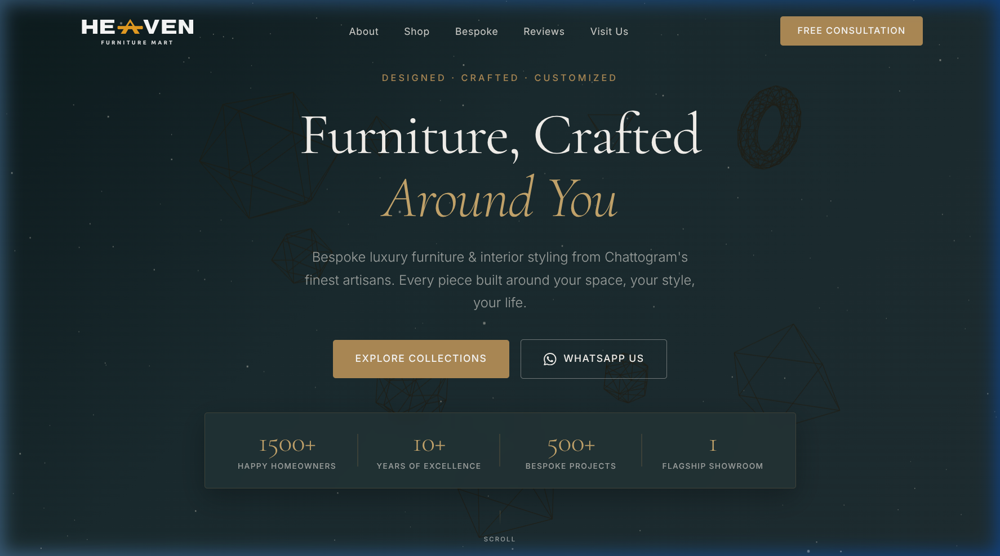
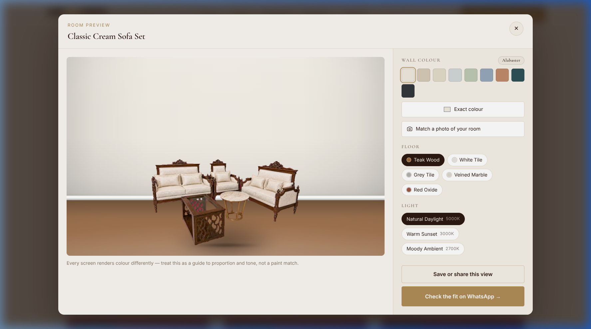
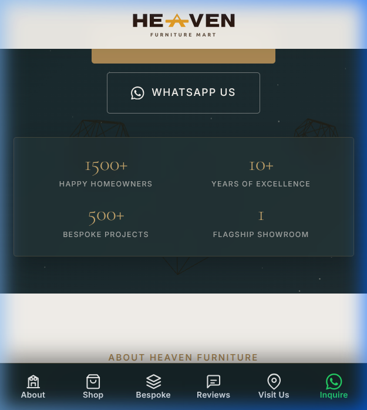

# 👑 Heaven Furniture Mart — Luxury Bespoke E-Commerce Platform

> **Live Application**: [https://heaven-furniture-mart-two.vercel.app/](https://heaven-furniture-mart-two.vercel.app/)



---

## 🎯 The Core Problems We Solved

When purchasing premium furniture online in Bangladesh, customers face severe doubt, uncertainty, and decision friction. **Heaven Furniture Mart** was built specifically to eliminate these buyer anxieties and deliver a high-converting, luxury browsing experience.

### 1. ❓ "Will this sofa or dining table actually suit my room color & flooring?" *(The #1 Furniture Purchase Barrier)*
- ❌ **The Customer Pain Point**: Buying expensive furniture online feels like a gamble. Customers struggle to visualize whether Chittagong teak, cobalt velvet, or cream leather will clash with their wall paint (e.g., Alabaster, Sage Green, Terracotta) or flooring (Wood, Tile, Marble).
- ✅ **Our Solution**: Built an **Interactive "See In My Room" Visualizer** (`<RoomPreview />`) directly into the product catalog. Customers can simulate wall colors, floor textures, and 3 distinct lighting environments in real-time before spending a single Taka.

### 2. ☕ "Will velvet or leather survive Bangladesh’s climate and daily tea/food spills?"
- ❌ **The Customer Pain Point**: High humidity, monsoon dampness, and accidental tea/oil spills ruin standard imported furniture textiles.
- ✅ **Our Solution**: Every catalog piece features **Spill-Shield Treated Fabrics** where liquids bead up for effortless wiping, paired with kiln-dried **Chittagong Teak timber foundations** engineered never to swell or warp.

### 3. 🪵 "Is it genuine solid wood or cheap MDF board with hidden flaws?"
- ❌ **The Customer Pain Point**: Unscrupulous sellers conceal particle board under thin veneers that sag within 2 years.
- ✅ **Our Solution**: Complete material transparency on every product card — detailed specs highlighting mortise-and-tenon joinery, 100% in-house artisan construction, and 15-year durability value estimates (e.g. *≈ ৳26/night over 15 years*).

### 4. 📱 "Clunky Mobile Navigation & Hidden Dropdowns"
- ❌ **The Customer Pain Point**: Traditional desktop navigation menus collapse into buried hamburger dropdowns on mobile, forcing extra taps and frustrating users.
- ✅ **Our Solution**: Implemented a **Native App-like Fixed Bottom Navigation Bar** with glassmorphism styling, unique vector icons, and scroll-spy active state tracking. Users can switch between *About, Shop, Bespoke, Reviews, Visit Us,* and *WhatsApp* with 1-tap thumb accessibility.

---

## 🎨 Interactive Room Visualizer ("See In My Room")



### Key Capabilities:
- 🎨 **8 Preset Paint Tones & Custom Color Picker**: Instantly test furniture against popular wall colors (Alabaster, Linen Cream, Sage Green, Terracotta, Deep Teal, Charcoal, etc.).
- 🪵 **5 Flooring Material Textures**: Switch between Chittagong Teak Wood, White Ceramic Tile, Grey Slate, Italian Veined Marble, and Traditional Red Oxide.
- 💡 **3-Stage Lighting Engine**: Simulate how pieces look under **5000K Natural Daylight**, **3000K Warm Sunset**, and **2700K Moody Ambient** night lighting.
- 📲 **1-Click WhatsApp Fit Inquiry**: Share the customized room scene directly with a 1-on-1 furniture consultant on WhatsApp.

---

## 📱 Mobile-First Native Experience



- 📌 **Permanently Fixed Bottom Bar**: Fast 1-tap section switching without menu hunting.
- 👁️ **Scroll-Spy Active Tracking**: Highlights active navigation items dynamically as the user scrolls.
- ⚖️ **Centered Responsive Header**: Centered brand identity and fluid layout variables (`clamp(16px, 4.5vw, 48px)`) for edge-to-edge layout safety on screens from 320px to 1440px+.

---

## 🛠️ Technology Stack

- **Framework**: [Next.js 14](https://nextjs.org/) (App Router, React 18, Server Components)
- **Styling**: Vanilla CSS Modules with dynamic CSS custom properties (`--brass`, `--surface-dark`, `--section-pad-x`)
- **Animation**: [Framer Motion](https://www.framer.com/motion/) (Scroll Reveal, Staggered Grids, Modal Portals)
- **Icons**: Hand-crafted inline SVG vector icons
- **Deployment**: [Vercel](https://vercel.com/) (CI/CD Automated Deployments)

---

## 🚀 Getting Started Locally

### Prerequisites
- Node.js `18.x` or higher
- npm `9.x` or higher

### Installation

```bash
# 1. Clone the repository
git clone https://github.com/aritradev/Heaven-Furniture-Mart.git

# 2. Navigate into project directory
cd Heaven-Furniture-Mart

# 3. Install dependencies
npm install

# 4. Run development server
npm run dev
```

Open [http://localhost:3000](http://localhost:3000) in your browser to view the application.

---

## 📄 License & Attribution
Created for **Heaven Furniture Mart**, Chattogram, Bangladesh. All rights reserved.
